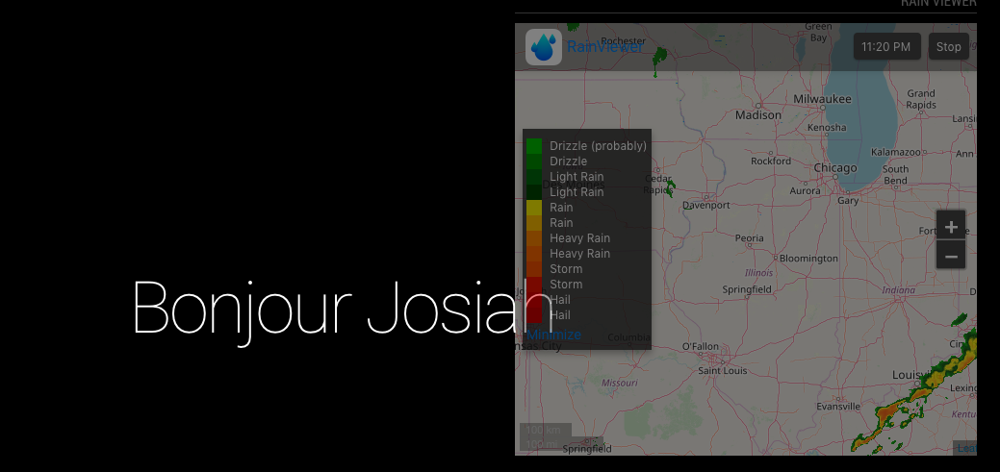

## MMM-RAIN-RADAR

* Inspired by and Replica of the MMM-ISS-Live module by Mykle1

* Displays the Rain Viewer map of [RainRadar](https://www.rainradar.net/) instead of ISS live

A real time animated map showing real time movement of precipitations. This module also uses the [US Government Weather API](https://www.weather.gov/documentation/services-web-api#) to get active weather alerts in a given US State. This API does not require any authentication of this date 05/30/2019.

## Example

## Installation

* `git clone https://github.com/jojoduquartier/MMM-RAIN-RADAR.git` into the `~/MagicMirror/modules` directory.

## Config.js entry and options

	{
		disabled: false,
		module: 'MMM-RAIN-RADAR',
		position: 'bottom_right',
		config: {
			useHeader: true,    // true if you want a header
			lat: "40.796850",   // Latitude
			lon: "-89.675960",  // Longitude
			area: 'IL',         // US State
		}
	},

## Config.js optional properties

	config: {
		zoomLevel: 6,
		mapType: 3, //0-Road Map 1-Satellite 2-Dark Map 3-OpenStreetMaps 4-Light Map
		color: 3, //0-Original 1-Universal Blue 2-TITAN 3-The Weather Channel 5-NEXRAD Level-III 6-RAINBOW @ SELEX-SI
		snow: 1,
		smoothing: 1,
		opacity: 88,
		fastAnimation: 0,
		coverage: 0,
		darkTheme: 1,
		UTCtime: 0,
		legend: 1,
		legendMin: 0, //set legend to 1 if you want legendMin to show
		animate: 1,
		updateOnWarning: 1, // 1: after updateInterval, weather warnings for your US states will be used to determine if module should be hidden. 0 module is perpertually displayed
		updateInterval: 5 * 60 * 1000, // number of milliseconds. change 5 to 60 and it will update each 10 minutes
	}

## Future Updates
* ~~Use US Weather warnings to hide/show radar~~ Done
* ~~Directly get lat and lon and set as default~~ Please Provide Lat and Lon
* Provide a list of precipitation related warnings so that module is update accordignly

## Acknowledgment
Special thanks to:
* [jewelltp](https://github.com/jewelltp) for coming up with the idea of the weather radar
* [mykle1](https://github.com/mykle1) for the rather easy and simple to follow code for the **MMM-ISS-Live** module
* [Oleksii Schastlyvyi](https://twitter.com/RainViewer) for providing an easily embeddable precipitation [radar](https://www.rainviewer.com/)
* All [contributors](https://github.com/jojoduquartier/MMM-RAIN-RADAR/graphs/contributors)
